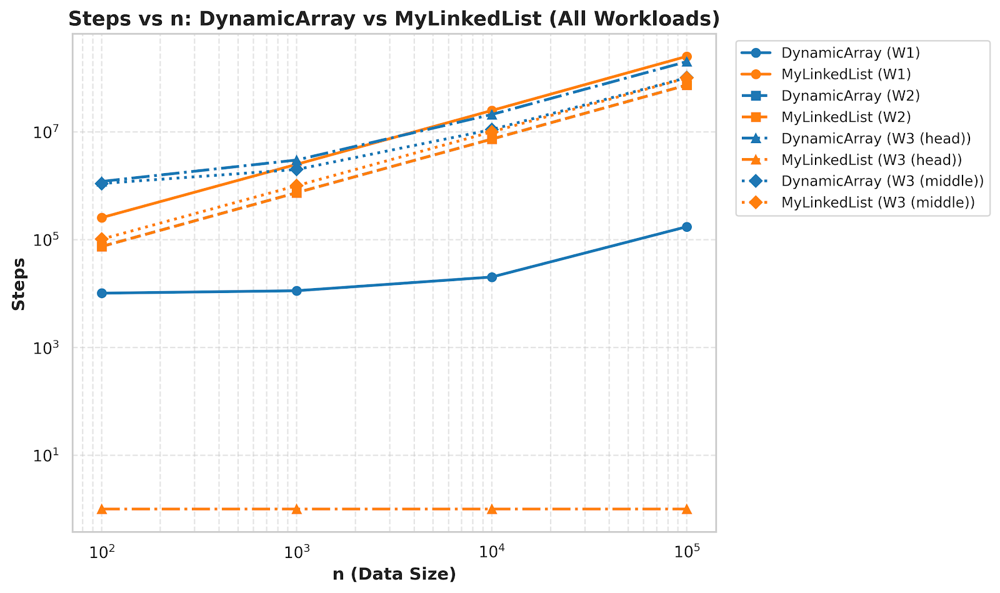
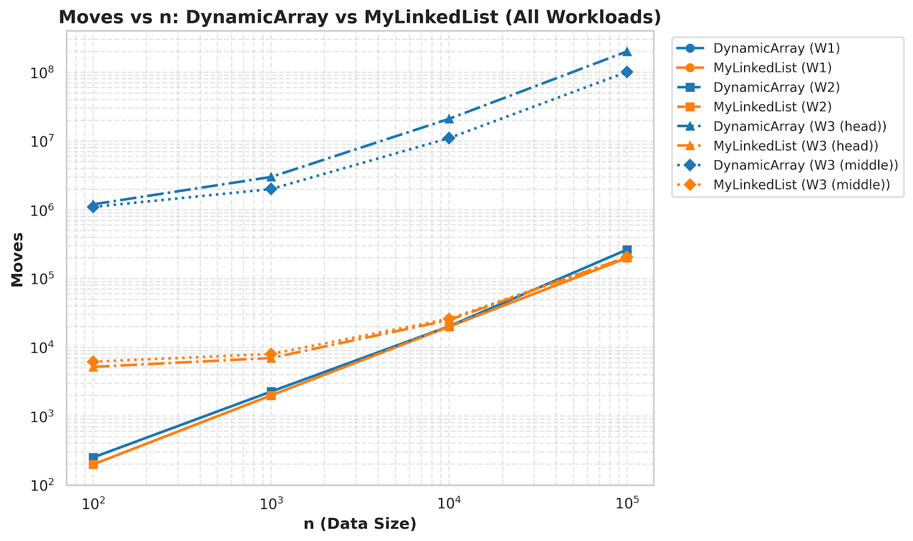
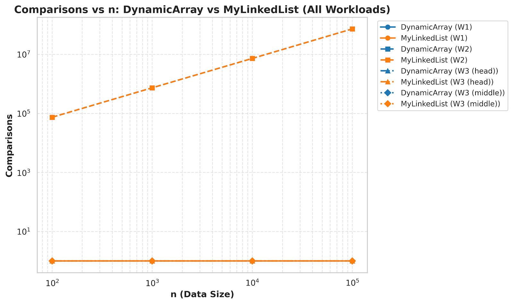
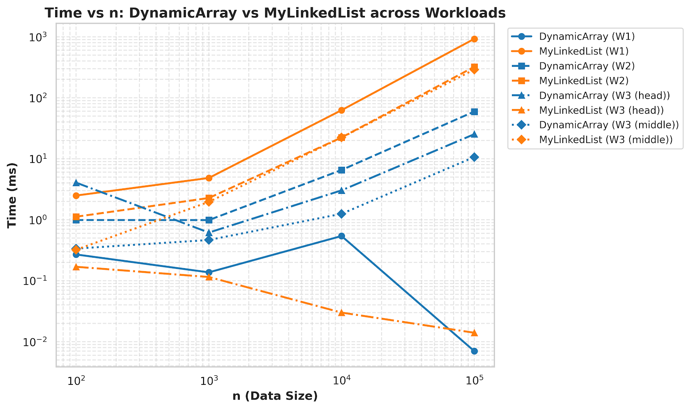

# REPORT

## 1. Complexity table

| Structure | Operation | Best | Average | Worst | Auxiliary space | Short justification |
|---|---:|---:|---:|---:|---:|---|
| DynamicArray | add(x) | Θ(1) | Θ(1) amortized | Θ(n) | Θ(n) | Usually append is constant; resize copies all elements. |
| DynamicArray | add(index, x) | Θ(n) | Θ(n) | Θ(n) | Θ(n) | Shifts elements to the right. |
| DynamicArray | remove(index) | Θ(n) | Θ(n) | Θ(n) | Θ(n) | Shifts elements to the left. |
| DynamicArray | get(index) | Θ(1) | Θ(1) | Θ(1) | Θ(n) | Direct array access. |
| DynamicArray | contains(x) | Θ(1) | Θ(n) | Θ(n) | Θ(n) | Linear scan. |
| MyLinkedList | add(x) | Θ(1) | Θ(1) | Θ(1) | Θ(n) | Tail pointer lets us append in constant time. |
| MyLinkedList | add(index, x) | Θ(1) | Θ(n) | Θ(n) | Θ(n) | Need to walk to the position first. |
| MyLinkedList | remove(index) | Θ(1) | Θ(n) | Θ(n) | Θ(n) | Need to find the node first. |
| MyLinkedList | get(index) | Θ(1) | Θ(n) | Θ(n) | Θ(n) | Walk from head or tail. |
| MyLinkedList | contains(x) | Θ(1) | Θ(n) | Θ(n) | Θ(n) | Linear scan through nodes. |
| MinHeap | insert(x) | Θ(1) | Θ(log n) | Θ(log n) | Θ(n) | Bubble-up height of heap. |
| MinHeap | peekMin() | Θ(1) | Θ(1) | Θ(1) | Θ(n) | Minimum is always at root. |
| MinHeap | extractMin() | Θ(log n) | Θ(log n) | Θ(log n) | Θ(n) | Bubble-down from root. |

## 2. Loop invariant proofs

### Proof 1: `DynamicArray.contains(x)`
**Invariant:** before each iteration of the loop, every element at positions `0..i-1` has already been checked, and none of them equals `x`.

**Initialization:** at the start `i = 0`, so the checked part is empty. The invariant is true.

**Maintenance:** if the invariant is true before checking position `i`, then after comparing `data[i]` with `x`, either the method returns `true`, or the loop moves to `i + 1` and the invariant still holds for all checked positions.

**Termination:** when the loop ends, all positions were checked and none matched, so the method correctly returns `false`.

**Conclusion:** the invariant shows that the method checks every element exactly once and gives the correct answer.

### Proof 2: `MinHeap.bubbleDown()`
**Invariant:** before each iteration, the subtrees below the current node are valid heaps, and the only possible violation is at the current node.

**Initialization:** after moving the last element to the root, both child subtrees are still heaps, so the invariant holds at the start.

**Maintenance:** the method swaps the current node with the smaller child when needed. This restores the heap property above the swapped child, and the only possible violation moves one level lower.

**Termination:** when the current node is smaller than both children, the whole structure satisfies the heap property.

**Conclusion:** the invariant proves that `extractMin()` restores a valid min-heap.

## 3. Discussion
DynamicArray is faster for `get(i)` because it uses direct array indexing. The CPU cache also helps because array elements are stored close together in memory. In a linked list, each node is a separate object, so the program must follow pointers from one node to the next. That pointer chasing is slower, even when the algorithmic complexity looks similar. The linked list can still be useful when inserts and removals happen a lot near the head or in the middle and you already know the position. The heap is a good choice when the main task is repeated priority removal. It keeps the smallest element at the root, so `peekMin()` is constant time. `extractMin()` is not constant, but it is still efficient enough for priority scheduling. For random access and iteration, DynamicArray is usually the better practical choice. For frequent boundary operations, the linked list is more natural. The benchmark should show that equal Big-O does not always mean equal runtime.

